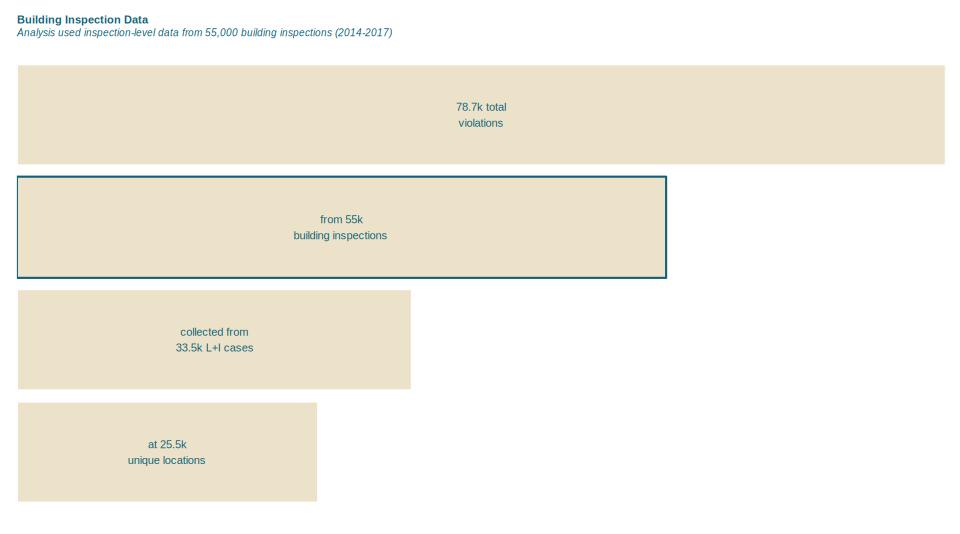

Lorem ipsum dolor sit amet, consectetur adipiscing elit. Nulla laoreet malesuada
purus. Aliquam non odio ut erat lacinia mollis. Ut scelerisque nisi mauris, a
convallis ante elementum eget. Maecenas enim nulla, suscipit ac nisl et, varius
varius neque.

## Load and wrangle data
Lorem ipsum dolor sit amet, consectetur adipiscing elit. Nulla laoreet malesuada
purus. Aliquam non odio ut erat lacinia mollis. Ut scelerisque nisi mauris, a
convallis ante elementum eget. Maecenas enim nulla, suscipit ac nisl et, varius
varius neque.

```{r eval=FALSE}

# packages
packages(c("tidyverse", "data.table", "sp", "rgdal", "lubridate", "plyr",
  "forcats", "caret", "spatstat", "RCurl", "jsonlite"))

# load spatial datasets
load("data/lni_data.Rdata")

# get coordinates as attributes
insp <- getCoords(insp)
viol <- getCoords(viol)

# join violations and inspections dataset
full_dat <- joinSPdfs(viol, insp, "casenumber")

# clean full data frame:
#   rename fields, creteUID, add a violation year field   
full_dat <- cleanData(full_dat)

# filter the data frame
#   remove some NA fields, closed inspections
filtered_dat <- filterData(full_dat)

# associate each inspection with other inspections in its case
#   measure outcomes of the same case before and after the inspection
#     in question
filtered_dat <- measureAllFails(filtered_dat)

# remove the initial inspection instances
df <- filtered_dat %>%
  filter(rec.inspStatus != "none") %>%
  filter(as.Date(violDte) < as.Date(inspCompl)) %>%
  data.table() %>%
  .[, c("organizati", "unit", "apdesc", "aptype") := NULL] %>%
  na.omit()

```

Lorem ipsum dolor sit amet, consectetur adipiscing elit. Nulla laoreet malesuada
purus. Aliquam non odio ut erat lacinia mollis. Ut scelerisque nisi mauris, a
convallis ante elementum eget. Maecenas enim nulla, suscipit ac nisl et, varius
varius neque.

Lorem ipsum dolor sit amet, consectetur adipiscing elit. Nulla laoreet malesuada
purus. Aliquam non odio ut erat lacinia mollis. Ut scelerisque nisi mauris, a
convallis ante elementum eget. Maecenas enim nulla, suscipit ac nisl et, varius
varius neque.

## Feature Engineering
Lorem ipsum dolor sit amet, consectetur adipiscing elit. Nulla laoreet malesuada
purus. Aliquam non odio ut erat lacinia mollis. Ut scelerisque nisi mauris, a
convallis ante elementum eget. Maecenas enim nulla, suscipit ac nisl et, varius
varius neque.

```{r eval=FALSE}

# create additional variables
df$zipShort <- substr(df$zip, 1, 5) %>% as.factor()
df$failed <- ifelse(df$inspStatus == "Failed", 1, 0)
df$before <- as.factor(df$before)

# add 3 variables indicating durations from previous events in lifecycle of
#   building case
df <- durationVars(df)
```

Lorem ipsum dolor sit amet, consectetur adipiscing elit. Nulla laoreet malesuada
purus. Aliquam non odio ut erat lacinia mollis. Ut scelerisque nisi mauris, a
convallis ante elementum eget. Maecenas enim nulla, suscipit ac nisl et, varius
varius neque.


```{r eval=FALSE}
# extract 'violation type' variable and remove levels occurring < 0.02%
#   of the time
df_violTpe  <- df %>%
  select(apinspkey, violDesc) %>%
  mutate(violTpe = fct_lump(violDesc, p = 0.02)) %>%
  dplyr::rename(id.apinspkey = apinspkey)

# generate a lookup table to get the names of violation types (for later
#   use)
violType_lookup <- getFactorLevelLookup(df_violTpe$violTpe, "violTpe")

# encode violation-type categorical feature as a series of binary
#   numeric dummy variables
df_violTpe <- castAndSumm(df_violTpe, "id.apinspkey", "violTpe", binary = FALSE)

```



```{r eval=FALSE}

# collapse dataset to the inspection level, summarizing
ds <- summariseInspections(df)

```

Lorem ipsum dolor sit amet, consectetur adipiscing elit. Nulla laoreet malesuada
purus. Aliquam non odio ut erat lacinia mollis. Ut scelerisque nisi mauris, a
convallis ante elementum eget. Maecenas enim nulla, suscipit ac nisl et, varius
varius neque.


```{r eval=FALSE}

# measure for spatial autocorrelation among repeat violators
ds <- endogMain(ds, nlist = c(5, 10))

# remove infrequently occuring categorical variables
ds$f.inspDesc <- fct_lump(ds$f.inspDesc, prop = 0.02)
ds$f.recStatus <- fct_lump(ds$f.recStatus, prop = 0.02)

# miscellaneous feature engineering
ds <- ds %>%
  mutate(f.numFailTypes = as.factor(squishToRange(e.numFailTypes))) %>%
  mutate(f.numViol = as.factor(squishToRange(e.numViol))) %>%
  mutate(f.prevFail = as.factor(squishToRange(e.prevFail))) %>%
  select(-e.numFailTypes, -e.numViol, -e.prevFail) %>%
  filter(is.finite(e.avgDists.repOfAll.n5))

```

## External Data Sources
Lorem ipsum dolor sit amet, consectetur adipiscing elit. Nulla laoreet malesuada
purus. Aliquam non odio ut erat lacinia mollis. Ut scelerisque nisi mauris, a
convallis ante elementum eget. Maecenas enim nulla, suscipit ac nisl et, varius
varius neque.

```{r eval=FALSE}
# vacant property indicators
# read dataset
vpi <- read.csv("http://data.phl.opendata.arcgis.com/datasets/f7ed68293c5\
                e40d58f1de9c8435c3e84_0.csv", stringsAsFactors = TRUE)

# look for address matches
ds$f.vpi.isBldgAddkey <- ifelse(
  ds$l.addresskey %in% vpi$LNIADDRESSKEY, 1, 0
  ) %>% as.factor()

# look for owner name matches
ds$f.vpi.isOwner <- ifelse(
  ds$l.owner %in% vpi$OWNER1, 1, ifelse(ds$l.owner %in% vpi$OWNER2, 1, 0)
  ) %>%
  as.factor()


# tax delinquency dataset
# encode and format api call
url <- URLencode("https://data.phila.gov/carto/api/v2/sql?q=SELECT owner,\
                 total FROM real_estate_tax_balances WHERE total > 0 AND \
                 tax_period > 2015 AND owner != ''")
url <- gsub("22", "27", url)

# get tax delinquency data
delinquent <- getURL(url)

# parse delinquency data from JSON
del <- fromJSON(delinquent)$rows %>%
  group_by(owner) %>%
  dplyr::summarise(s.ownerTaxBalance = mean(total)) %>%
  dplyr::rename(l.owner = owner)

# extract a dataset of tax balance data for each property
ds.temp <- ds %>%
  mutate(l.owner = as.character(l.owner)) %>%
  left_join(del) %>%
  select(s.ownerTaxBalance) %>%
  mutate(
    s.ownerTaxBalance = ifelse(
      is.na(s.ownerTaxBalance), 0, s.ownerTaxBalance)) %>%
  mutate(f.ownerDelinquent = as.factor(ifelse(s.ownerTaxBalance > 5, 1, 0)))

# and bind it to the master dataset
ds <- cbind(ds, ds.temp)
```

## Dealing with categorical variables
Lorem ipsum dolor sit amet, consectetur adipiscing elit. Nulla laoreet malesuada
purus. Aliquam non odio ut erat lacinia mollis. Ut scelerisque nisi mauris, a
convallis ante elementum eget. Maecenas enim nulla, suscipit ac nisl et, varius
varius neque.

<div class="embedded-tweet">
  <blockquote class="twitter-tweet" data-partner="tweetdeck"><p lang="en" dir="ltr">One-Hot Encoding <a href="https://twitter.com/hashtag/machinelearningflashcards?src=hash">#machinelearningflashcards</a> <a href="https://t.co/n3gUivTxLc">pic.twitter.com/n3gUivTxLc</a></p>&mdash; Chris Albon (@chrisalbon) <a href="https://twitter.com/chrisalbon/status/895737233986142208">August 10, 2017</a></blockquote>
  <script async src="//platform.twitter.com/widgets.js" charset="utf-8"></script>
</div>

Lorem ipsum dolor sit amet, consectetur adipiscing elit. Nulla laoreet malesuada
purus. Aliquam non odio ut erat lacinia mollis. Ut scelerisque nisi mauris, a
convallis ante elementum eget. Maecenas enim nulla, suscipit ac nisl et, varius
varius neque.

```{r eval=FALSE}

# get list of factor variable names
names <- ds %>%
  select(starts_with("f.")) %>%
  names %>%
  as.list

# encode each of these as  a series of binary dummy variables
factor_variable_list <- llply(names, castFactorVars, dat = ds,
                              .progress = "text")

# join all categorical data variable dfs together
ds <- plyr::join_all(factor_variable_list, by = "id.apinspkey",
                     type = "left", match = "all") %>%
  left_join(df_violTpe, "id.apinspkey") %>%
  select(-id.apinspkey) %>%
  cbind(ds,. )

# generate two different response variables, factor and numeric
#   for different model types
ds <- ds %>%
  dplyr::rename(o.failed.n = o.failed) %>%
  mutate(o.failed.f = as.factor(o.failed.n)) %>%
  select(o.failed.n, o.failed.f, 2:ncol(.))

# create a vector of variable names that will be used in the models
# and one that won't
mod_vars <- ds %>% select(
  -o.numFails, -starts_with("i."),
  -starts_with("l."), -starts_with("f.")) %>%
  names
non_mod_vars <- setdiff(names(ds), mod_vars)

```

Lorem ipsum dolor sit amet, consectetur adipiscing elit. Nulla laoreet malesuada
purus. Aliquam non odio ut erat lacinia mollis. Ut scelerisque nisi mauris, a
convallis ante elementum eget. Maecenas enim nulla, suscipit ac nisl et, varius
varius neque.
