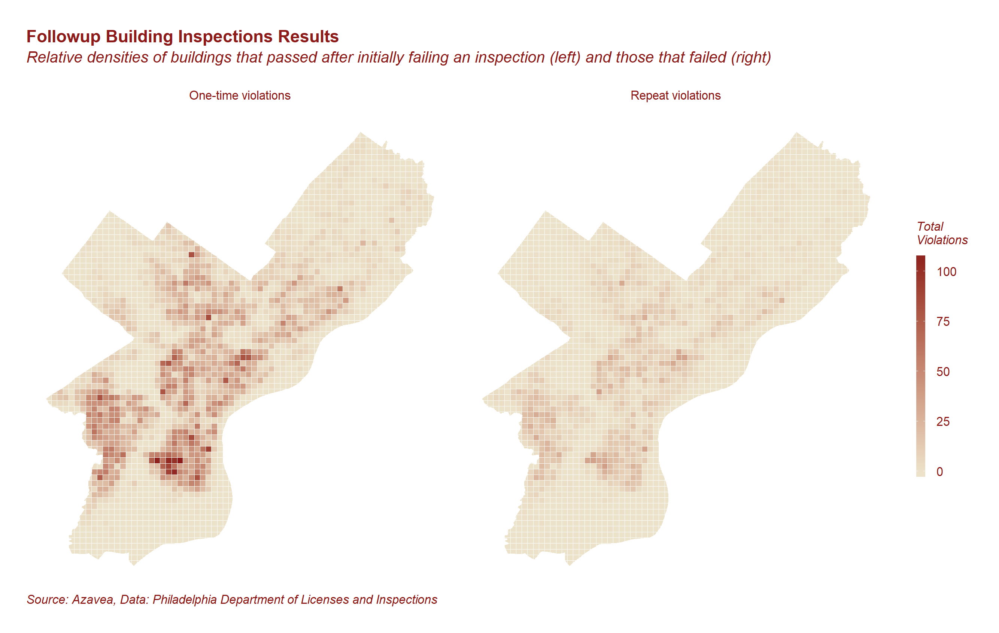

</img>

#Predicting Building Code Compliance
#with Machine Learning Models

______

Here on the Data Analytics team at Azavea, we partner with government agencies, non-profits, and private companies to develop data tools that inform decision-making. One of the ways that organizations can effectively use data is to build machine learning models. These models generate predictive intelligence that cities can use to address resource allocation questions. When and where are crimes most likely to occur? Which water mains are most likely to spring leaks? How will new road infrastructure improve pedestrian safety? We can use predictive models to help cities make informed guesses about the answers to these questions.

We have built a proof of concept model that seeks to answer one of these questions: Which buildings should inspectors prioritize in order to maximize public safety? We have included a detailed description of our process in this site.

</img>

We have divided this project into four sections: [data pre-processing](https://azavea.github.io/building-inspection-prediction/data-wrangling-and-feature-engineering.html), [feature selection](https://azavea.github.io/building-inspection-prediction/feature-selection.html), [model building](https://azavea.github.io/building-inspection-prediction/model-selection.html) and finally, [results](file:///C:/files/data_analytics/building-inspection-prediction/docs/results.html). In addition to code snippets and annotation, these sections each include images and plots that help give a full picture of the process.

This writeup is meant to be fairly technical. For a higher level look at the project, check out its [wrtiteup on the Azavea blog](https://www.azavea.com/blog/2017/09/15/building-inspection-prediction/). If you would like to replicate this analysis, feel free do download the [repository](https://github.com/azavea/building-inspection-prediction).

This project was completed by the Data Analytics Team at Azavea. The data we used came from the City of Philadelphia Departments of Licenses and Inspections, Revenue, and Innovation and Technology. We conducted the analysis using R and made use of the following packages: dplyr, tidyr, ggplot2, data.table, magrittr, sp, rgdal, lubridate, plyr, forcats, caret, spatstat, RCurl, jsonlite, Boruta, pROC, statmod, h2o, sf, ggjoy, plotROC, ggpubr, waffle and svglite. 
