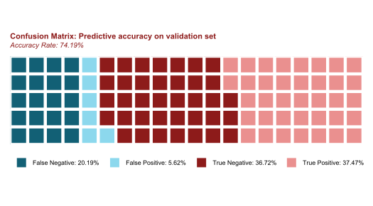

We will discuss how we constructed our models in the following sections, but first we'll jump right in and look at the our results. Each of our models generated continuous predicted probabilities that a each inspection will result in a failure. In order to convert a percent likelihood of failure into a binary prediction, we need to specify a prediction threshold. All predictions with probabilities above that threshold will be classified as predicted fails and all below will be predicted to pass. In choosing a prediction threshold, we have to balance the trade off between sensitivity (the proportion of correctly identified positives) and specificity (the rate of correctly classified negatives). We can visualize the dynamics of this trade-off using the receiver operating characteristic (ROC) curves shown below. The area under the curve (AUC) value indicates how difficult this trade off is. Therefore the higher the AUC value, the better the model fits the data. You can see that the GBM model slightly beats out the RF model on this metric.


Goodness of fit metrics like AUC are useful in comparing models but they are somewhat abstract. If a city department were to consider implementing this type of model, they would be much more interested in knowing the accuracy rate: what percentage of inspections could they accurately predict for using this model. We won't know what the actual future accuracy rate would be without making predictions and waiting them out. Without the luxury of this type of natural experiment, we simulated one by using our model to predict for the remaining 40% validation set that we extracted at the beginning. When we predicted for the validation set and compared our results to the observed outcome, we found that we predicted with a 74.19% accuracy rate. The plot below shows how these predictions broke down.

<!--  -->


True and False indicate whether or not the prediction was (True) or incorrect (False). Positive and Negative explain what the prediction was. A positive prediction is a case in which we predicted that an inspection would fail and a negative prediction is a case where we predicted that it would pass. Each unique combination of these two binaries make up the four categories you see above. We arrived at this particular distribution using a prediction threshold that maximized accuracy in the test set, however that does not mean that it is categorically the best one to choose. If the department's main priority was to waste no time on inspections that would ultimately pass then they may pick a high threshold that maximizes sensitivity.

We can also check for spatial bias in the model by mapping these results. These maps below are organized as a confusion matrix. All of these maps seem to have density distributions that are proportionally similar to the distribution of all inspections. This is a good sign as it indicates that the model isn't overfit to one particular part of the city.


Without any understanding of the data, you may not know what to make of these accuracy rates. You need some sort of baseline to compare them to in order to determine the quality of the model. This metric approximates the accuracy rate we could expect without any predictive intelligence. One way to calculate a baseline is by determining what our accuracy rate would be if we guessed the most frequently occurring outcome every time.

```{r eval=TRUE, echo=FALSE}
load("../data/full_dataset_for_modeling.Rdata")
source("../R/helper-functions.R")
```

```{r eval=TRUE}

# packages
packages(c("tidyverse", "data.table", "sp", "caret", "plyr", "pROC", "statmod",
           "h2o", "Boruta"))

# baseline accuracy
baseline <- round(max(table(ds$o.failed.n)) / nrow(ds), 2)
print(paste0("Baseline Accuracy: ", baseline))

```

When we look at this metric for our dataset, we see that 57% of the outcomes are failures. If we had no other information available, our best strategy would be to guess "fail" every time which would lead to a 57% accuracy rate. Therefore Our 74% accuracy rate represents a nearly 20% increase over the baseline. There is certainly room to improve, but we believe that the ability to guess correctly 20% more frequently would be valuable to an agency that is allocating inspectors.

In the [next section](data-wrangling-and-feature-engineering.html) we will begin walking you through or modelling process, beginning with the steps we took to pre-process our data.  
