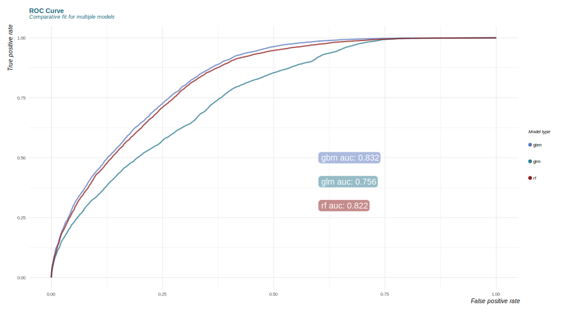
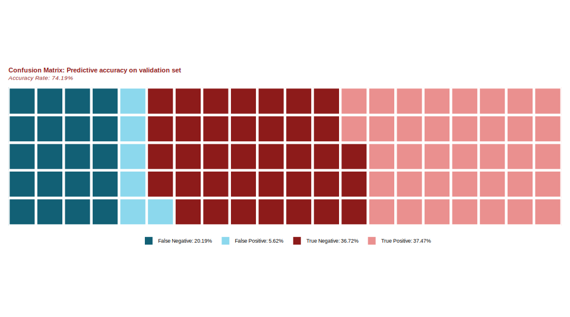

Each of these models discussed in the previous section generated continuous predicted probabilities that a each inspection will result in a failure. In order to convert a percent likelihood of failure into a binary prediction, we need to specify a prediction threshold. All predictions with probabilities above that threshold will be classified as predicted fails and all below will be predicted to pass. In choosing a prediction threshold, we have to balance the trade off between sensitivity (the proportion of correctly identified positives) and specificity (the rate of correctly classified negatives). We can visualize the dynamics of this trade-off using the receiver operating characteristic (ROC) curves shown below. The area under the curve (AUC) value indicates how difficult this trade off is. Therefore the higher the AUC value, the better the model fits the data. You can see that the GBM model slightly beats out the RF model on this metric.



Goodness of fit metrics like AUC are useful in comparing models but they are somewhat abstract. If a city department were to consider implementing this type of model, they would be much more interested in knowing the accuracy rate: what percentage of inspections could they accurately predict for using this model. We won't know what the actual future accuracy rate would be without making predictions and waiting them out. However, in the absence of this type of actual experiment, we can simulate one by using our model to predict for the remaining 40% validation set that we extracted at the beginning. When we predicted for the validation set and compared our results to the observed outcome, we found that we predicted with a 74.19% accuracy rate. The plot below shows how these predictions broke down.

<!--  -->


False negatives are instances in which the model predicted failure but the result was a pass. True positives are inspections in which the model predicted a failure and it turned out to be correct, and so on and so forth. This distribution is based on the prediction threshold that maximized accuracy in the test set, however that does not mean that it is categorically the best one to choose. If the department's main priority was to waste no time on inspections that would ultimately pass then they may pick a high threshold that maximizes sensitivity.

We can also check for spatial bias in the model by mapping these results. These maps below are organized as a confusion matrix. All of these maps seem to have density distributions that are proportionally similar to the distribution of all inspections. This is a good sign as it indicates that the model isn't overfit to one particular part of the city.


Of course these rates don't mean much in the absence of context. We need to compare the accuracy rate to some sort of baseline in order to understand what sort of value the predictive model may add. This baseline indicates the accuracy rate we could expect with no predictive intelligence. One way to do this is by figuring out how accurately we would predict if we guessed the most frequently occurring outcome every time.

```{r eval=TRUE, echo=FALSE}
load("../data/full_dataset_for_modeling.Rdata")
source("../R/helper-functions.R")
```

```{r eval=TRUE}

# packages
packages(c("tidyverse", "data.table", "sp", "caret", "plyr", "pROC", "statmod",
           "h2o", "Boruta"))

# baseline accuracy
baseline <- round(max(table(ds$o.failed.n)) / nrow(ds), 2)
print(paste0("Baseline Accuracy: ", baseline))

```

In the case of our inspection dataset, failures occur 57% of the time. Therefore, with no other information at our disposal, our best strategy would be to guess "fail" every time and we would achieve a 57% accuracy rate. Our 74% accuracy rate may have some room to improve, but it still represents a nearly 20% increase over the baseline.
